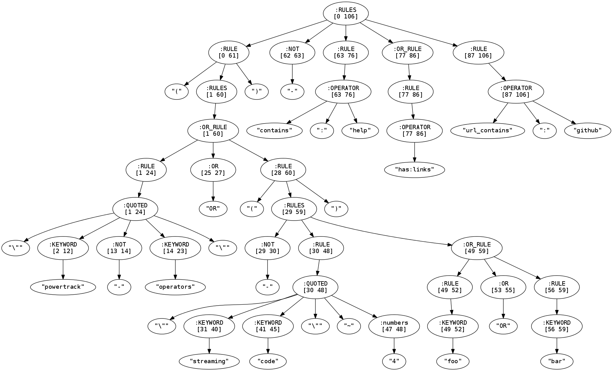

Clojure [Instaparse](https://github.com/Engelberg/instaparse) port of original [Fastparse](https://github.com/jeroenr/gnip-rule-validator) version from [Jeroen](https://github.com/jeroenr).

Main rule definition is in [gnip-rule.bnf](https://github.com/wibisono/gnip-rule-validator-clj/blob/master/gnip-rule.bnf) file.

Sample output using Instaparse/visualize (based on Rhizome):



## Visualizing

Image above is produced from REPL

```
lein repl
user=> (use 'gnip-rule-validator.core) (use 'instaparse.core) (in-ns 'gnip-rule-validator.core)

gnip-rule-validator.core=> (insta/visualize (gnip-parser "(\"powertrack -operators\" OR (-\"streaming code\"~4 foo OR bar)) -contains:help has:links url_contains:github") :output-file "gnip-rule.png")

gnip-rule-validator.core=> (insta/visualize (gnip-parser "(\"powertrack -operators\" OR (-\"streaming code\"~4 foo OR bar)) -contains:help has:links url_contains:github"))
```

## Testing

TDD Spec suit is using [Specl](https://github.com/Engelberg/instaparse)
``` 
lein spec
```
